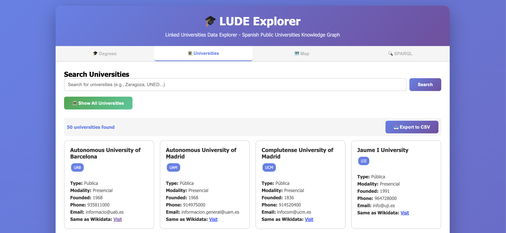
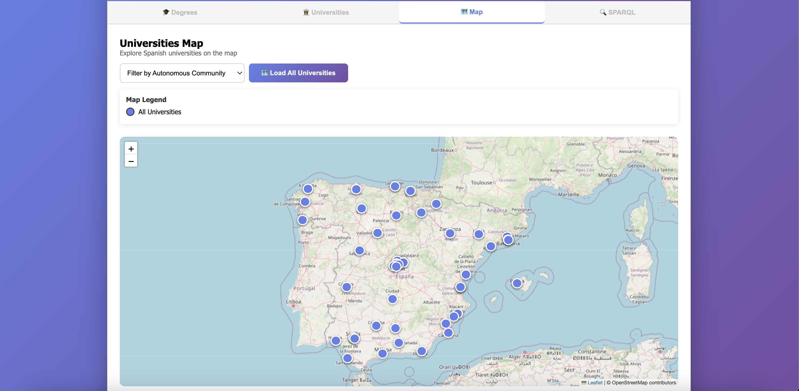
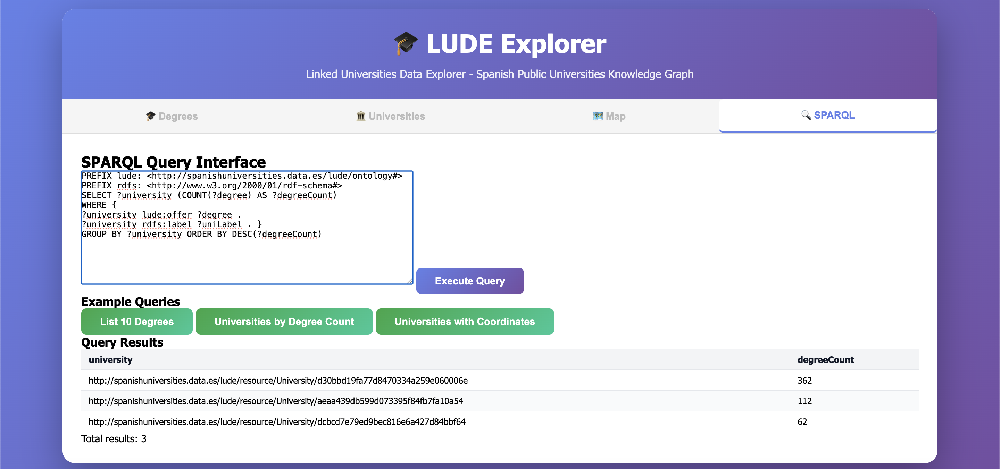

# 📘 Linked Universities Data Explorer

*A Linked Data application to explore Spanish university degrees, with SPARQL-powered backend and modern web frontend.*

---

## 🌐 Overview

This project provides an interactive explorer for Spanish university degrees, integrating multiple regional open datasets and exposing them as Linked Data using RDF, SPARQL, and a REST API.

Main features:

* 🔍 Search universities and degrees
* 🎚 Filter by community, university, branch, academic year
* 🗺 Interactive map of universities
* 🔗 Outbound Linked Data connections (Wikidata)
* 🐢 Export RDF (Turtle) (complete dataset)
* 🧠 Local SPARQL endpoint
* 🐍 Flask backend + modern JavaScript frontend

---

## 📁 Project Structure

```
project/
 |── app.py      # Backend: queries and endpoint
 |── requirements.txt    # In case you want to create an environment from scratch use it
 |── last.ttl        # Your RDF dataset
 |── index.html  # Frontend: application interaction (open in browser directly)
 ├── venv/       # The environment to use
 ├── client_example.py
 └── README.md
```

---

# 🧩 1. Requirements

* **Python 3.9+**
* VSCode

---

# 🧱 2. Backend Setup

Create ann environment:

```bash
python3 -m venv venv
```


Activate it:

```bash
source venv/bin/activate   # macOS/Linux
venv\Scripts\activate      # Windows
```

Install dependencies:

```bash
pip install -r requirements.txt
```

---

## 🚀 2.2 Run the Backend

```bash
python app.py
```

Server will run at:

```
http://localhost:5000
```

### ⚠️ Windows Users - Important Fix for SPARQL Filters
If you are running this project on Windows, Python f-strings may fail when building the SPARQL query due to escaping rules.

To fix this, replace the filter lines starting around line 341 of app.py with the following Windows-safe version:

```
        {f'FILTER(CONTAINS(LCASE(?acLabel), "{ac}"))' if ac else ''}
        {f'FILTER(CONTAINS(LCASE(?uniLabel), "{uni}"))' if uni else ''}
        {f'FILTER(CONTAINS(LCASE(?areaLabel), "{area}"))' if area else ''}
        {f'FILTER(CONTAINS(LCASE(?provLabel), "{prov}"))' if prov else ''}
        {f'FILTER(CONTAINS(LCASE(?munLabel), "{mun}"))' if mun else ''}
        {f'FILTER(CONTAINS(LCASE(?levelLabel), "{level}"))' if level else ''}
```

---

# 💻 3. Frontend Setup

Open the index.html file using Live Server in VSCode and it will be running in this port (in your browser):

```bash
http://localhost:5500
```
### ⚠️ Troubleshooting: Connection Errors

If you experience connection errors between the frontend and backend, you can test the backend directly by visiting:

```http://127.0.0.1:5000/instances?class=University```

If the browser returns an error such as:

```Param.postParse2() missing 1 required positional argument: 'tokenList'```

or any similar “missing tokenlist” message:

1) Stop the backend server
2) Wait a few seconds
3) Start the server again
4) After starting it, wait 5–10 seconds before issuing any query


# 🙌 Contributors

* **Wenwen Yang** — Application developer & SPARQL design (using iOS Mac)
* **Roopha** — Windows integration and testing

---

# App demostration

Below is a walkthrough of the **LUDE Explorer** interface and its main functionalities.

### 1. 🎓 Degrees Tab

* Search for degrees using keywords (e.g.,** ***Matemáticas*,** ***Ingeniería*).
* Apply advanced filters by autonomous community, province, university, knowledge area, or academic level.
* View results in interactive cards showing university, level, area, ECTS, campus, modality, faculty, and external links (Wikidata).


### 2. 🏛️ Universities Tab

* Search universities by name or city.
* Browse all universities with cards showing acronym, type, modality, founding year, contact info, and Wikidata links.



### 3. 🗺️ Map Tab

* Explore Spanish universities on an interactive Leaflet map.
* Filter by autonomous community.
* Color-coded markers indicate community affiliation.
* Popups show university name and community.



### 4. 🧩 SPARQL Tab

* Run**custom SPARQL queries** directly against the LUDE knowledge graph.
* Submit queries in**raw SPARQL syntax** via a text editor or input box.
* Execute queries with a "Execute" button to get immediate results.
* Results are displayed in a table for easy inspection.



---
